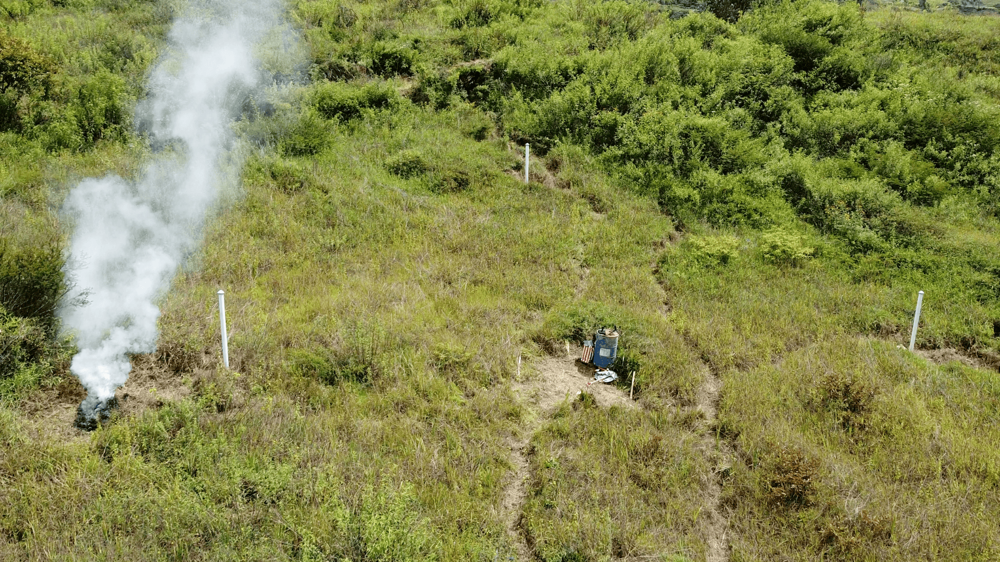

<h1 align="center">ForestProtector: An IoT Architecture Integrating Machine Vision and Deep Reinforcement Learning for Efficient Wildfire Monitoring</h1> 

This repository contains supplementary material for the conference paper [*"ForestProtector: An IoT Architecture Integrating Machine Vision and Deep Reinforcement Learning for Efficient Wildfire Monitoring"*](https://arxiv.org/abs/2501.09926) (ICARA 2025 Oral session). **Authors:** Kenneth Bonilla-Ormachea, [Horacio Cuizaga](https://www.linkedin.com/in/horacuizr/), [Edwin Salcedo](https://www.linkedin.com/in/edwinsalcedo), Sebastian Castro, [Sergio Fernandez-Testa](https://www.linkedin.com/in/sergio5919/), and [Misael Mamani](https://www.linkedin.com/in/misaelmq680/).  

[[Project page]](https://edwinsalcedo.com/publication/forest-protector) [[arXiv]](https://arxiv.org/abs/2501.09926) 

<p align="center">

</p>

<p align='right'><i>  Status: Repo Under Construction  </i></p> 

## Contents
[1. Overview](#overview) </br>
* [Motivation](#motivation) </br>
* [IoT architecture](#iotarchitecture) </br>
* [Hardware prototype](#hardwareprototype) </br>

[2. Computer vision system](#cvsystem) </br>
* [Data collection](#datacollection) </br>
* [Computer vision pipeline](#cvpipeline) </br>
* [3DCNN](#3dcnn) </br>

[3. Deep reinforcement learning agent](#drlagent) </br>

[4. Validation](#validation) </br>

[5. Getting started](#gettingstarted) </br>
* [Initial inference samples](#initialinference) </br>
* [Graphical user interface (GUI)](#gui) </br>
* [On-device deployment](#deployment) </br>

[6. Citation](#citation) </br>
<br>

<a id="overview"></a> 
## 1. Overview

<a id="motivation"></a> 
### Motivation

<a id="iotarchitecture"></a> 
### IoT architecture

<a id="hardwareprototype"></a> 
### Hardware prototype

<a id="cvsystem"></a>
## 2. Computer vision system

<a id="datacollection"></a> 
### Data collection 

<a id="cvpipeline"></a> 
### Computer vision pipeline

<a id="3dcnn"></a> 
### 3DCNN

<a id="dlragent"></a>
## 3. Deep reinforcement learning agent

<a id="validation"></a> 
## 4. Validation 

<a id="gettingstarted"></a>
## 5. Getting started

<a id="initialinference"></a> 
### Initial inference samples

<a id="gui"></a> 
### Graphical User Interface (GUI)

<a id="deployment"></a> 
### On-device deployment


<a id="citation"></a>
## 6. Citation

If you find *ForestProtector* useful in your project, please consider citing the following paper:

```
@article{bonilla2025forestprotector,
  title={ForestProtector: An IoT Architecture Integrating Machine Vision and Deep Reinforcement Learning for Efficient Wildfire Monitoring},
  author={Bonilla-Ormachea, Kenneth and Cuizaga, Horacio and Salcedo, Edwin and Castro, Sebastian and Fernandez-Testa, Sergio and Mamani, Misael},
  journal={arXiv preprint arXiv:2501.09926},
  year={2025}
}
```
