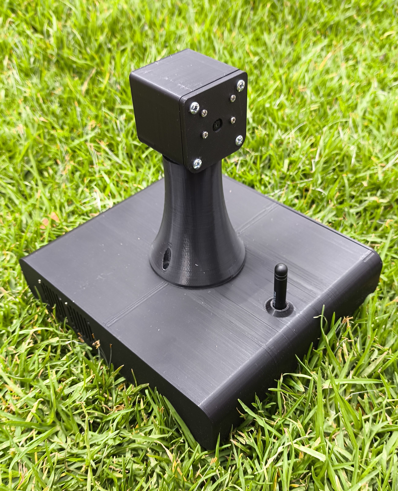

<h1 align="center">LoRa Gateway</h1>

  

This directory contains the firmware, hardware wiring, and configuration details for the central gateway of the ForestProtector wildfire monitoring system. The gateway receives data from IoT sensor nodes via LoRa and performs processing based on a reinforcement learning algorithm. This algorithm enables the system to dynamically determine which area the thermal surveillance camera should focus on, optimizing zone monitoring effectiveness.

The intelligent processing is handled by a **Jetson Nano**, which receives data through a **LilyGo T3S3** microcontroller equipped with LoRa connectivity. This setup ensures efficient, low-power communication while maintaining a modular and scalable architecture. The Jetson analyzes the input data and computes an optimal motion policy, generating commands that drive a camera positioning system to point toward the selected critical zone.

This system is designed to operate autonomously in forest environments, prioritizing high-risk areas based on the real-time sensor data collected by remote nodes.

## Contents  
[1. Components](#components)  
[2. Schematic diagram](#wiring)  
[3. Files included](#files)  
[4. Physical design and assembly](#design)  
[5. Library setup](#libraries)  
[6. Firmware behavior](#firmware)  
[7. Field deployment considerations](#considerations)  
 
