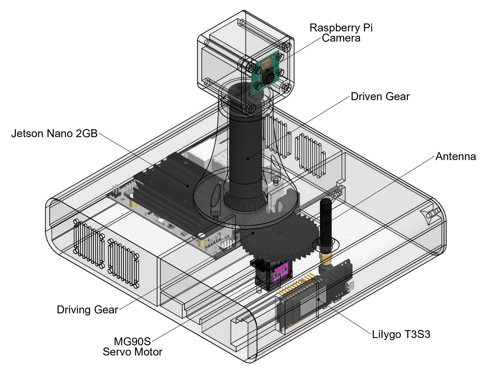

<h1 align="center">LoRa Gateway</h1>

  

This directory contains the firmware, hardware wiring, and configuration details for the central gateway of the ForestProtector wildfire monitoring system. The gateway receives data from IoT sensor nodes via LoRa and performs processing based on a reinforcement learning algorithm. This algorithm enables the system to dynamically determine which area the thermal surveillance camera should focus on, optimizing zone monitoring effectiveness.

The intelligent processing is handled by a **Jetson Nano**, which receives data through a **LilyGo T3S3** microcontroller equipped with LoRa connectivity. This setup ensures efficient, low-power communication while maintaining a modular and scalable architecture. The Jetson analyzes the input data and computes an optimal motion policy, generating commands that drive a camera positioning system to point toward the selected critical zone.

This system is designed to operate autonomously in forest environments, prioritizing high-risk areas based on the real-time sensor data collected by remote nodes.

## Contents  
[1. Components](#components)  
[2. Schematic diagram](#wiring)  
[3. Files included](#files)  
[4. Physical design and assembly](#design)  
[5. Library setup](#libraries)  
[6. Firmware behavior](#firmware)  
[7. Field deployment considerations](#considerations)  
 

## 1. Components

- **LilyGo T3S3 V1.1** – ESP32-S3 microcontroller with integrated SX1262 LoRa transceiver  
- **Jetson Nano** – Embedded computer with ARM Cortex-A57 CPU and Maxwell GPU, used for reinforcement learning-based decision making  
- **Pi Camera Module (Rev 1.3)** – Connected to the Jetson Nano via CSI interface for thermal or visual monitoring  
- **SG90 servo** – Servo motor for pan or tilt control of the camera
- **LoRa antenna** – External 868 MHz/915 MHz antenna for long-range communication
-
- **3D printed enclosure** – Designed in PETG for weather resistance (UV and moisture protection)
- **Power supply** – Jetson Nano-compatible power source (e.g., 5V–4A via USB-C or 5.5 mm barrel connector)  

## 2. Schematic diagram

  

*(to be completed)*

## 3. Files included

- [`gateway_code.ino`](gateway_code.ino): Arduino firmware for the LilyGo T3S3 microcontroller. It receives LoRa packets, parses the data sent by the IoT sensor nodes, and forwards it to the Jetson Nano via serial communication. It also receives commands from the Jetson to control the servo responsible for camera orientation.

- `python/` *(to be completed)*: Folder intended for the scripts that run on the Jetson Nano. These include the reinforcement learning algorithm, Q-table management, camera control, and communication with the microcontroller.

- `cad_files/`: Editable 3D design files created in SolidWorks.
  - The main part file for customizing the gateway enclosure is [`gateway_parts.SLDPRT`](cad_files/gateway_parts.SLDPRT).
  - [`gateway_with_electronics.SLDASM`](cad_files/gateway_with_electronics.SLDASM) contains the full assembly with electronic components integrated in their intended positions.

- `3d_printing_files/`: STL files ready for 3D printing.  
  - This folder also includes [`gateway_all_parts.3mf`](3d_printing_files/gateway_all_parts.3mf), a pre-arranged layout with all parts correctly positioned and oriented for slicing and export.

  
## 4. Physical Design and Assembly

The physical design of the gateway is essential to ensure proper operation under various environmental conditions. We recommend housing the components in a weatherproof enclosure, such as an IP65-rated box, which will protect the electronics from dust, water, and other environmental factors. For this project, alternatively, the system can be placed under a roof or surface that shields it from direct sunlight and rain.

**Recommended 3D printing settings:**
- Material: PETG (preferred over PLA due to its superior outdoor durability)
- Layer height: 0.2 mm
- Infill: 20–30%
- Orientation: All STL files in the [`3d_printing_files`](3d_printing_files) folder are pre-oriented for printing. Some parts may require supports, but all were designed to minimize or eliminate their use.

**Assembly steps:**

1. Print all parts available in the [`3d_printing_files`](3d_printing_files) folder.
2. Connect all components to their respective cables: Jetson Nano to its power supply, T3S3 to its power cable, and the camera to the CSI cable.
3. Insert the [`servo_gear_camera_drive.stl`](3d_printing_files/servo_gear_camera_drive.stl) part onto the already mounted SG90 servo shaft, securing it with the screws provided with the motor.
4. Mount the two 5V fans to the bottom of the [`gateway_enclosure.stl`](3d_printing_files/gateway_enclosure.stl) part and secure them using appropriate screws.
5. Place the T3S3 board, Jetson Nano, and SG90 servo motor in their designated slots inside [`gateway_enclosure.stl`](3d_printing_files/gateway_enclosure.stl). Secure the Jetson and the motor using one screw each.
6. To secure the T3S3, insert the LoRa antenna through the top opening of [`gateway_enclosure.stl`](3d_printing_files/gateway_enclosure.stl), and fix it using the matching nuts and adjustment pieces.
7. For the camera assembly: first, attach the camera module to [`camera_module_cover.stl`](3d_printing_files/camera_module_cover.stl) using the appropriate screws. Insert a bearing into [`camera_gear_connector.stl`](3d_printing_files/camera_gear_connector.stl), then mount [`camera_cable_pillar.stl`](3d_printing_files/camera_cable_pillar.stl) into the bearing. Connect all parts with screws. The bearing allows smooth movement of the assembly.
8. Next, join [`camera_module_enclosure.stl`](3d_printing_files/camera_module_enclosure.stl) to the previously assembled camera module using the same screws. Route the camera cable through the provided slot and secure [`camera_module_enclosure.stl`](3d_printing_files/camera_module_enclosure.stl) to [`camera_module_cover.stl`](3d_printing_files/camera_module_cover.stl), completing the pan-tilt structure.
9. Insert the fully assembled camera module into [`gateway_enclosure.stl`](3d_printing_files/gateway_enclosure.stl), ensuring that the gears mesh properly. Secure the module with two screws; the height will auto-align.
10. **Additional recommendation:** Ensure that the servo motor is set to its initial position before meshing the drive gear and camera gear. This step ensures proper alignment of movement and helps protect the CSI cable from torsion or damage.
11. Finally, close the enclosure by screwing on the [`gateway_enclosure_cover.stl`](3d_printing_files/gateway_enclosure_cover.stl) part, using it as a lid. Make sure to leave the Jetson Nano's power cable routed through the dedicated notch or opening to exit the enclosure safely.

**Assembly reference:**

  

