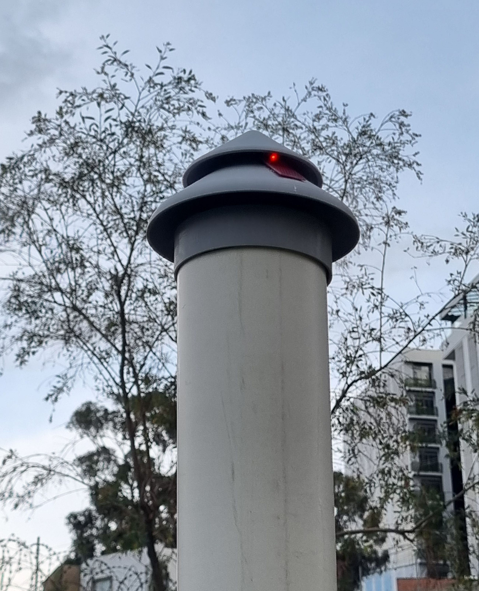
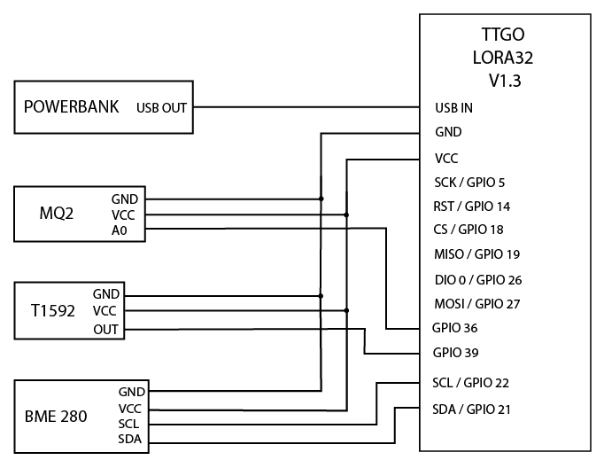
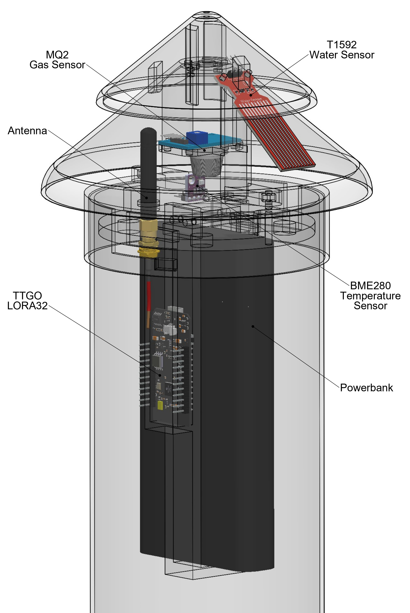

<h1 align="center">IoT Sensor Node</h1>

<p align="center">
  
</p>

This directory contains the firmware, hardware design, and assembly documentation for the IoT sensor nodes used in the ForestProtector wildfire monitoring system. These nodes collect environmental data (gas, temperature, humidity, rain) and send it wirelessly to the central gateway via LoRa communication.

## Contents  
[1. Components](#components) </br>
[2. Schematic diagram](#wiring) </br>
[3. Files included](#files) </br>
[4. Physical design and assembly](#design) </br>
[5. Library setup](#libraries) </br>
[6. Firmware behavior](#firmware) </br>
[7. Field deployment considerations](#considerations) </br>
<br>

<a id="components"></a>
## 1. Components

- **TTGO LoRa32 V1.0** – ESP32 microcontroller with built-in SX1276 LoRa module  
- **BME280** – environmental sensor for temperature, humidity, and pressure (I2C)  
- **MQ2** – gas and smoke sensor (analog output)  
- **T1592** – rain sensor (analog output)  
- **3D printed enclosure** – printed in PETG for outdoor resistance  
- **5V power source** – LiPo battery or USB power bank

<a id="wiring"></a>
## 2. Schematic diagram

<p align="center">
  
</p>

The diagram above illustrates the physical wiring between the TTGO LoRa32 board and the environmental sensors. Note that the LoRa transceiver is integrated into the TTGO board, and its SPI pins must be explicitly set in the firmware. The BME280 communicates over I2C, while the MQ2 and T1592 sensors use analog outputs connected to GPIO36 and GPIO39, respectively. Ensure that sensors requiring 3.3V or 5V are connected accordingly to avoid damage.

<a id="files"></a>
## 3. Files included

- [`iot_node_code.ino`](iot_node_code.ino): Arduino code for the sensor node. It reads data from the sensors and sends it to the T3S3 board at the gateway via LoRa using a structured string array. The code evaluates thresholds for temperature, humidity, and gas levels, and sends only key status indicators. To deploy this firmware, upload it to the TTGO LoRa32 board using the Arduino IDE.

- `cad_files/`: Editable 3D design files created in SolidWorks.  
  - The main part file for customizing the node's structure is [`design1.SLDPRT`](cad_files/design1.SLDPRT).  
  - [`new_roof.SLDPRT`](cad_files/new_roof.SLDPRT) contains an alternative version of the rain shield.  
  - [`iot_node.SLDASM`](cad_files/iot_node.SLDASM) assembles all parts and includes virtual models of the electronic components in their correct positions.

- `3d_printing_files/`: STL files ready for 3D printing.  
  - This folder also includes [`iot_node_all_parts.3mf`](3d_printing_files/iot_node_all_parts.3mf), a pre-arranged printing layout with all parts positioned and oriented for slicing and export.

<a id="design"></a>
## 4. Physical design and assembly

The node enclosure was designed in SolidWorks and optimized for 3D printing in PETG, which provides enhanced resistance to weather conditions such as UV exposure and humidity. Its geometry allows it to be easily mounted on a standard 4-inch PVC pipe, making it ideal for elevated outdoor deployment in forest environments.

**Recommended 3D printing settings:**
- Material: PETG (preferred over PLA for outdoor durability)
- Layer height: 0.2 mm
- Infill: 20–30%
- Orientation: All STL files in the [`3d_printing_files`](3d_printing_files) folder are pre-oriented for printing. Some parts may require supports, but all were designed to minimize or eliminate their use.

> The part [`iot_node_lower_canopy.stl`](3d_printing_files/iot_node_lower_canopy.stl) contains internal cavities in its leg-like extensions designed to hold M3 nuts. To take advantage of this, a pause should be programmed during the print using your slicer software (e.g., Cura or PrusaSlicer). This feature allows for stronger and more secure assembly.

**Assembly steps:**

1. Print all parts available in the [`3d_printing_files`](3d_printing_files) folder.
2. Connect the **TTGO LoRa32** board to its power cable.
3. Insert the board into the correct slot of the [`iot_node_power_and_boards_holder.stl`](3d_printing_files/iot_node_power_and_boards_holder.stl) part. The second slot is reserved for a Raspberry Pi Pico-R3, considered for future extensions.
4. Place the power bank in the center of the same holder piece, with its USB ports facing downward for easier access.
5. Slide the board holder into the base part [`iot_node_sensor_base.stl`](3d_printing_files/iot_node_sensor_base.stl) and secure them using four 8mm M3 screws.
6. Mount the **BME280** sensor on top of the sensor base, facing upward. Route its wires through the dedicated holes to reach the inner compartment where the microcontroller is located.
7. Attach the LoRa antenna to `iot_node_sensor_base.stl` using its own screws and nuts. The antenna should point vertically upward.
8. Place the **MQ2** sensor (with wires already connected) below and inside the [`iot_node_lower_canopy.stl`](3d_printing_files/iot_node_lower_canopy.stl) part. Run the wires through the side slot designed into one of its vertical columns.
9. Repeat the process with the **T1592 rain sensor**, routing its wires through the same slot.
10. Place the [`iot_node_upper_canopy.stl`](3d_printing_files/iot_node_upper_canopy.stl) over the lower canopy to protect the rain sensor. Secure it with zip ties.
11. Once all sensors are in place, join the following parts using two M3 screws (minimum 30 mm in length):
    - First, secure `iot_node_sensor_base.stl` to `iot_node_main_body.stl` (as if the latter were its lid). At this point, the BME280 sensor and the antenna should protrude through their respective openings.
    - Then pass the same screws through `iot_node_lower_canopy.stl`, locking the full structure together.
12. Before final assembly, make sure that all cables are long enough to reach from the sensors to the board and that they pass properly through the designated cable channels.
13. To attach the device to the PVC pipe, notches must be cut into the pipe. These details can be found in the assembly file [`iot_node.SLDASM`](cad_files/iot_node.SLDASM). Once the pipe is prepared, the enclosure can be twisted onto it as if it were threaded.
14. (Optional) Apply silicone or waterproof sealant around exterior joints to improve resistance to rain or moisture.

**Assembly reference:**

<p align="center">
  
</p>

<a id="libraries"></a>
## 5. Library setup

To compile and upload the code to the TTGO LoRa32 board, use the **Arduino IDE** (version 1.8.19 or newer is recommended, or the latest Arduino 2.x release).

First, install the **ESP32 board support**:

- Go to: `File > Preferences` and add this URL to *Additional Board URLs*:
  ```
  https://raw.githubusercontent.com/espressif/arduino-esp32/gh-pages/package_esp32_index.json
  ```
- Then go to: `Tools > Board > Boards Manager`, search for **ESP32**, and install the package by *Espressif Systems*.

### Required libraries

Install these libraries via the **Library Manager** (`Tools > Manage Libraries`):

- `LoRa` by Sandeep Mistry  
- `Adafruit BME280` by Adafruit  
- `Adafruit Unified Sensor` by Adafruit  

> Tip: Your BME280 may use address `0x76` or `0x77`, adjust it in the code if needed.

### Upload settings

- **Board**: ESP32 Dev Module  
- **Port**: USB port where the TTGO is connected  
- **Baud rate**: 115200  
- **Flash frequency**: 80 MHz (default)  
- **Partition scheme**: Default (or "Minimal SPIFFS" if needed)

> If your board is not detected, ensure USB drivers for CP210x or CH340 are installed.


<a id="firmware"></a>
## 6. Firmware behavior

The firmware running on the IoT node follows a simple loop structure that performs the following tasks every 5 seconds:

1. **Sensor readings**:
   - The **MQ2 gas sensor** is read digitally. Its value is converted into a binary flag (`1` if gas is detected, `0` otherwise).
   - The **rain sensor** is read via analog input (0–4095).
   - The **BME280 sensor** provides temperature (°C), humidity (%), and pressure (hPa).

2. **Data formatting**:
   - A data string is created in the following format:  
     ```
     <node_id>:<mq2_flag>,<rain_value>,<temperature>,<humidity>,<pressure>
     ```
   - Example output:
     ```
     1:1,3240,27.85,44.12,1008.55
     ```

3. **LoRa transmission**:
   - The data string is sent over LoRa using the `LoRa.beginPacket()`, `LoRa.print()`, and `LoRa.endPacket()` functions.
   - The gateway node (e.g., T3S3) receives this data and identifies the sender by the node ID.

4. **Serial monitor output**:
   - The same data string is printed to the serial monitor for debugging and verification.

5. **Repeat**:
   - The loop pauses for 5 seconds using `delay(5000)` before restarting the cycle.

This structure allows lightweight and periodic transmission of sensor status to a remote gateway, suitable for battery-powered, low-bandwidth field deployment.

<a id="considerations"></a>
## 7. Field deployment considerations

The IoT node is designed for outdoor installation in remote, forested environments. The following recommendations help ensure optimal performance and durability in the field:

### Sensor placement

- **Height**: Mount the device on a 4-inch PVC pipe elevated above vegetation (e.g., 2–3 meters) to improve environmental exposure.
- **Orientation**: Ensure that the LoRa antenna is facing upward and not obstructed.
- **MQ2 sensor**: Should be positioned where smoke can reach it easily—avoid tight enclosures or air-sealed compartments.
- **Rain sensor**: Must be uncovered and positioned horizontally under the protective canopy to detect water droplets accurately.

### Environmental protection

- Apply **silicone or waterproof sealant** to external joints, especially between 3D-printed parts, to prevent water ingress.
- Use **PETG** or other weather-resistant materials for enclosures; PLA is not recommended for long-term outdoor use.

### Sensor calibration and testing

- Allow the **MQ2 sensor** to stabilize for several minutes after powering on (warm-up time).
- Compare BME280 readings with a trusted reference to check for sensor drift.
- Periodically clean the rain sensor surface and MQ2 housing to prevent false readings due to debris or dust.

### Maintenance tips

- Check battery level (if using rechargeable power banks) every few weeks, depending on usage and environment.
- Inspect for cable wear or loose connections, especially in high-humidity areas.
- Avoid placing nodes under dense canopy or inside enclosed metal structures that may block LoRa signals.

> Following these practices will extend the device's lifespan and increase the reliability of wildfire detection data in real deployments.
